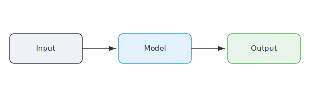
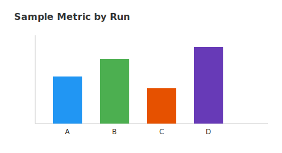
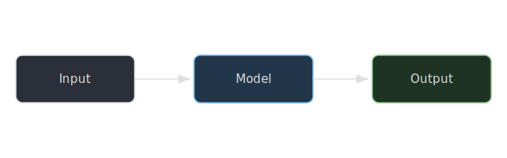

<!-- =========================================================================
     MEDIA: images, dark-mode handling, and embeds.
     ========================================================================= -->

### Images & captions

A standard image with a numbered, cross-referenceable caption (@fig-plain). Set width with `{width=...}`; the caption is
the text in the `![...]` brackets.

Controlling the spacing around a figure is done separately per format. In HTML, wrap it in a `<div>` and set `padding`
(or `margin`). In the PDF, add `#v(<len>)` before and after with raw Typst blocks. Also note the differences between
captioned, cross-referenced figures and raw images, see further below.

::: {.content-visible when-format="html"}
<div style="padding: 0em 0;">
{#fig-plain width=70%}
</div>
:::

::: {.content-visible when-format="typst"}
```{=typst}
#v(-3em)
```

{#fig-plain width=70%}

```{=typst}
#v(0em)
```
:::

Add the `.img-rounded` class for soft rounded corners and a hairline border --- nice for screenshots and photos.

{.img-rounded width=45%}

Manual tuning: width can also be an **absolute unit** (e.g. `2cm`) and images can be aligned with `fig-align`. Leave off
the `![...]` caption text for an uncaptioned image. Add manual padding with `<div style="padding: 2em;">` (HTML) and
`#pad` (PDF).

::: {.content-visible when-format="html"}
<div style="padding: 2em;">
{.light width="2cm" fig-align="center"}
{.dark width="2cm" fig-align="center"}
</div>
:::

::: {.content-visible when-format="typst"}
```{=typst}
#pad(
  top: 2em,
  bottom: 0em,
  align(center, image("assets/logo.svg", width: 2cm))
)
```
:::

### Dark-mode images

Light-background raster images (charts, screenshots) look wrong on a dark page. Two one-class fixes --- both are **HTML
dark-mode only**: in the PDF (and in HTML light mode) there is no dark page to fix, so the images below render as-is.
Toggle the site to dark mode to see each effect.

- **`.auto-invert`** --- inverts luminance in dark mode (whites become dark), while keeping hues roughly correct. Best
  for line/bar charts and UI screenshots.

{.auto-invert width=60%}

- **`.light-island`** --- leaves the image untouched but sits it on a light rounded "island" so it stays readable in
  dark mode. Best when inverting would look odd (e.g. photos, logos, colored diagrams).

{.light-island width=60%}

```{=typst}
#pagebreak()
```

### Light/dark image swap (best for SVG diagrams)

For diagrams where you want *purpose-built* light and dark artwork, ship two files and let CSS show the right one. Mark
them `.light` and `.dark`; only the HTML has a theme toggle, so the PDF just uses the light version. On the HTML render,
toggle the site theme to see it switch.

::: {#fig-swap}
::::: {.content-visible when-format="html"}
{.light width=90%}
{.dark width=90%}
:::::

::::: {.content-visible when-format="typst"}
```{=typst}
#v(-3em)
```

{width=90%}
:::::

A diagram that swaps artwork between light and dark mode (HTML), with a single version in the PDF.
:::

### Embedded iframes

Iframes (interactive charts, maps, live demos) exist only on the web, so wrap them in an HTML-only block and give the
PDF a static fallback image. Wrapping the iframe in `.datawrapper-panel-group` also makes it invert in dark mode (see
`styles.css`).

::: {.content-visible when-format="html"}
```{=html}
<div class="datawrapper-panel-group" style="margin: 40px 0 20px 0; width: 100%;">
  <div style="display: flex; flex-direction: column; align-items: center; gap: 0px;">
    <iframe src="https://datawrapper.dwcdn.net/wQR5S" style="width: 100%; max-width: 850px; border: none; display: block;" scrolling="no"></iframe>
  </div>
</div>

<script type="text/javascript">
  !function(){"use strict";window.addEventListener("message",(function(a){if(void 0!==a.data["datawrapper-height"]){var e=document.querySelectorAll("iframe");for(var t in a.data["datawrapper-height"])for(var r=0;r<e.length;r++)if(e[r].contentWindow===a.source){var i=a.data["datawrapper-height"][t]+"px";e[r].style.height=i}}}))}();
</script>
```
:::

::: {.content-visible when-format="typst"}
```{=typst}
#figure(
  stack(
    dir: ltr,
    spacing: 0fr,
    image("assets/ramp1.png", width: 60%),
  ),
)
```
:::
